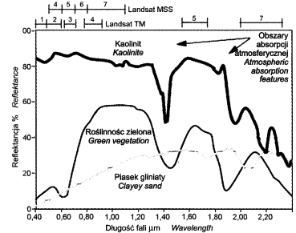
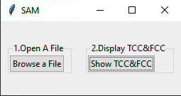

 [fig:z12]

(1,0)300
[0.25in]
[2mm] (1,0)200
[2cm] Segmentacja ,,kostki” hiperspektralnej z wykorzystaniem sygnatury spektralnej obiektu
[6cm]

Jacek Ciuba **152082**
3 czerwiec 2020

Wprowadzenie
============

Dane hiperspektralne
--------------------

Słowo ,,hiper” oznacza nadmierny w rozmiarze, w jakości lub ”ponad, powyżej”. Nadmiarowa informacja wynika z bardzo dużej rozdzielczości spektralnej (wąskie zakresy rejestracji dla poszczególnych kanałów) oraz dużej liczby kanałów w stosunku do danych multispektralnych, jak również z bardzo szerokiego zakresu fal promieniowania elektromagnetycznego, dla którego rejestrowany jest dany obraz. Większość sensorów, które są nazwane hiperspektralnymi posiada ponad 40 kanałów z rozdzielczością spektralną
\< 20 nm.

Systemy hiperspektralne rejestrują odbite od powierzchni Ziemi promieniowanie w dziesiątkach a nawet setkach wąskich ciągłych kanałów, co umożliwia charakteryzowanie różnych typów pokrycia terenu bardziej szczegółowo niż z wykorzystaniem danych pozyskiwanych przez sensory wielospektralne (rys. 1).

 [fig:z12]

Ilość informacji spektralnej zarejestrowanej przez spektometry hiperspektralne często przekracza zakres wymagany do identyfikacji wielu obiektów. Większość hiperspektralnych sensorów lotniczych np. Hyperion, rejestruje promieniowanie elektromagnetyczne dla zakresów widzialnego (VIS) bliskiej i średniej podczerwieni (NIR i SWIR). Niektóre z nich (np. DAIS) posiadają dodatkowy sensor umożliwiający rejestrację również w zakresie termalnym (8000 - 12600 nm) lub rejestrują promieniowanie tylko dla tego zakresu.

Sensory hiperspektralne dostarczają pełną spektralną informację o badanym obiekcie, jak również wydobywają cechy, które wcześniej nie były możliwe do pozyskania. Większość obiektów na powierzchni Ziemi charakteryzuje się obecnością specyficznych cech na krzywej reprezentującej wartości odbitego od nich promieniowania elektromagnetycznego. Większość z tych cech jest możliwa do wychwycenia jedynie w bardzo wąskich fragmentach spektrum, które jako oddzielne zakresy spektralne rejestrują sensory hiperspektralne. Ta właściwość zdjęć hiperspektralnych powoduje, że ich zastosowanie w celu wydzielenia różnych formacji roślinnych wpływa na znaczne zwiększenie dokładności klasyfikacji w porównaniu z danymi wielospektralnymi.

Zastosowanie obrazów hiperspektralnych
======================================

Geografia, geologia, kartografia i dziedziny pokrewne
-----------------------------------------------------

Obrazowanie wielospektralne znajduje zastosowanie w systemach zbierania informacji geograficznych, w tym zwłaszcza w Systemach Informacji o Terenie. Dane multispektralne pozwalają na zdobycie o wiele pełniejszej informacji o terenie, niż tradycyjna fotografia satelitarna. Na podstawie analizy światła odbitego przez różne fragmenty terenu można wyciągać wnioski na temat rodzaju skał, składu i wilgotności gleby, a także rodzaju roślinności zasiedlającej teren (w tym roślinności oceanicznej).

Meteorologia
------------

Satelitarne obrazy wielospektralne są szczególnie ważne dla meteorologii - pozwalają na badanie rozkładu koncentracji pary wodnej, a także rozkładów temperatur gruntu, wody i mas powietrza. Protoplastą technik multispektralnych w meteorologii były jednokanałowe fotografie w podczerwieni.

Ekologia, leśnictwo, rolnictwo
------------------------------

Obrazy multipsektralne i hiperspektralne są przydatne w badaniu rozkładu populacji roślin, w szczególności flory oceanicznej oraz drzewostanów na obszarach leśnych. Dokładna analiza światła odbitego od roślin pozwala na wykrycie obecności określonych gatunków drzew, a także wskazuje ich ogólny ,,stan zdrowia”.

Inwigilacja, ratownictwo, poszukiwania obiektów
-----------------------------------------------

Dzięki obrazowaniu wielospektralnemu możliwa jest identyfikacja obiektów częściowo ukrytych, które byłyby niewidoczne w obrazie tradycyjnych kamer kolorowych lub podczas obserwacji bezpośredniej.

Kryminalistyka
--------------

W technice kryminalistycznej obrazowanie wielospektralne jest narzędziem pozwalającym na przyśpieszenie prac śledczych. Wielospektralne fotografie kryminalistyczne miejsc i dowodów zbrodni pozwalają na szybkie wykrycie mikrośladów określonych substancji organicznych lub chemicznych.

Historia sztuki, archeologia
----------------------------

W badaniach zabytkowych dzieł sztuki, w tym obrazów, książek obrazowanie wielospektralne jest niezastąpionym narzędziem nieinwazyjnego badania autentyczności oraz ukrytej treści dzieła.

Segmentacja ”kostki” hiperspektralnej metodami hiperspektralnymi
================================================================

W literaturze wielu naukowców prezentuje wyniki badań uzyskane na podstawie modelowania fizycznego i matematycznego, które w sposób optymalny ekstrahuje informację z danych hiperspektralnych. Analiza danych ma na celu ekstrakcję informacji zawartej w danych hiperspektralnych, dla których zakres i możliwośći analiz obrazowych zostały znacznie rozszerzone, ze względu na zwiększenie rozdzielczości spektralnej. Metody Analizy danych hiperspektralnych można podzielić ze wzlędu na sposób ekstrakcji informacji zawartej w pikselach obrazu. Aspinall dzieli je na metody pikselowe oraz metody podpikselowe. Pierwsza grupa to procedury, które klasyfikują piksel poprzez identyfikację głównego komponentu danego piksela. Do nich należą m.in. Spectral Angle Mapper (SAM), Binary Encoding (BE), Spectral Feature Fitting (SFF), Continuum Removed (CR). Natomiast do drugiej grupy Aspinall zalicza algorytmy podpikselowe, pozwalające oszacować skład materiału znajdującego się w obrębie danego piksela, a należą do nich: Linear Spectral Unmixing (LSU), Matched Filtering (MF), Mixture Tuned Matched Filtering (MTMF). Podobnego podziału dokonał Plaza nazywając te dwie grupy procedur technikami całych pikseli i pikseli mieszanych. Plaza podkreśla także, że obraz należy analizować używając wszystkich dostępnych metod i algorytmów, ponieważ w obrębie danej sceny znajdują się tereny, gdzie odpowiedź spektralna może pochodzić od grupy pikseli czystych spektralnie lub od pikseli silnie zmieszanych.

Pikselowe metody klasyfikacji danych hiperspektralnych
------------------------------------------------------

### Spectral Angle Mapper (SAM)

Spectral Angle Mapper (SAM) jest to metoda automatycznego porównywania krzywych spektralnych uzyskanych z obrazu z krzywymi bibliotek spektralnych utworzonymi na podstawie pomiarów terenowych lub laboratoryjnych. Jak krzywe referencyjne mogą być wykorzystane także krzywe spektralne uzyskane z obrazu (tzw endmembersy) lub krzywe spektralne z bibliotek odpowiedzi spektralnych dostępnych z różnych źródeł zewnętrznych (np. biblioteka laboratoriów USGS, JPL). Wartości odpowiedzi spektralnej dla piksela w n - kanałach można potraktować jako współrzędne wektora w przestrzeni n - wymiarowej. W postaci wektora może również zostać przedstawiona odpowiedź spektralna wzorca. Algorytm metody SAM oparty jest na porównaniu wektorów spektralnych dla każdego piksela analizowanego obrazu z wektorami spektralnymi dla obiektów referencyjnych.

Obliczany jest kąt pomiędzy tymi wektorami według następującego wzoru:

\[\alpha = cos^{-1}\left ( \frac{\sum_{i = 1}^{nb} t_{i} r_{i}}{(\sum_{i = 1}^{nb} t_{i}^2)^{\frac{1}{2}} (\sum_{i = 1}^{nb} r_{i}^2)^{\frac{1}{2}}} \right )\]

gdzie:

-   \(\alpha\) = kąt spektralny pomiędzy wzorcem, a krzywą spektralną danego piksela

-   nb = ilość kanałów spektralnych

-   t = wektor odpowiedzi spektralnej wzorca

-   r = wektor odpowiedzi spektralnej analizowanego piksela

W algorytmie tym, oceniany jest otrzymany kąt, nie długość wektora.

 [fig:z12]

Zalety tego algorytmu to:

-   Szybka i łatwa implementacja

-   Zrozumiały dla użytkownika

-   Względnie odporny na różnice w oświetleniu (topografia, źródło światła, sensor itp.)

-   Porównywalność widm obrazu z widmami laboratoryjnymi

Wady tego algorytmu to:

-   Tolerancji oświetlenia towarzyszy niewrażliwość na wykrywanie pewnych zmian fizjologicznych

-   Podobne widma, które różnią się tylko znacząco albedo (np. lasy iglaste i lasy liściaste) są błędnie klasyfikowane

Implementacja własna algorytmu SAM
==================================

Do implementacji algorytmu wykorzystano znaleziony w internecie [kod](https://github.com/aditis1204/spectral-angle-mapper), który posłużył jako baza projektu.
Został on całkowicie zmodyfikowany, ponieważ autor programu w zły sposób zaimplementował algorytm.
Po dłuższej analizie, kod został poprawiony, tak aby spełniał wymagania dotyczące projektu.

Stack technologiczny
--------------------

Wybrany język programowania to Python wraz z następującymi bibliotekami:

-   rasterio - biblioteka pozwalająca na zaimportowanie kostki hiperspektralnej w formacie .tif do programu;

-   numpy - biblioteka pozwalająca na szybsze działanie na macierzach

-   tkinter - biblioteka pozwalająca na stworzenie interfejsu do komunikacji z użytkownikiem

Omówienie interfejsu graficznego
--------------------------------

Po uruchomieniu pliku programu w odpowiednio skonfigurowanym środowisku, użytkownik otrzymuje do komunikacji z programem okno, pozwalające na wybranie kostki hiperspektralnej w formacie .tif oraz na wyświetlenie obrazu *True Colour Composite* oraz *False Colour Composite*.

 [fig:z12]

Po wybraniu pliku kostki hiperspektralnej oraz po kliknięciu przycisku *Show TCC & FCC* wyświetlane zostaną wcześniej wspomniane dwa obrazy.

 [fig:z12]

Obraz wydaje się zbyt ciemny, ponieważ zastosowano normalizację liniową, a powinna zostać zastosowana normalizacja według następującego wzoru:

 [fig:z12]

gdzie \(\alpha\) określa szerokość zakresu intensywności wejściowej, a \(\beta\) określa intensywność, wokół której zakres jest wyśrodkowany.

Zignorowano jednak implementację tego algorytmu normalizującego, ponieważ nie było to głównym problemem tego projektu a z przedstawionych fotografii można wybrać bez problemu piksele reprezentatywne dla klas które chcemy wyróżnić z przedstawionego obrazu FCC.

W celu wybrania sygnatur spektralnych interesujących nas klas, należy dwa razy kliknąć lewym klawiszem myszy na wybrany piksel.

Po wybraniu interesujących nas pikseli należy zamknąć wszystkie okna programu i zaczekać aż ten sprawdzi wszystkie piksele we wszystkich warstwach kostki hiperspektralnej. Czas oczekiwania na wyniki wydłuża się wraz z ilością wybranych wcześniej reprezentatywnych pikseli.
Po chwili otrzymujemy następujący obraz:

 [fig:z12]

Piksele oznaczone na czerwono, zielono oraz niebiesko są reprezentantami wcześniej wybranych sygnatur.
Reszta czarnych pikseli nie została przydzielona do żadnej klasy.

Na końcu, wyświetlane jest podsumowanie działania programu, przedstawiające zestawienie wszystkich 3 obrazów:

 [fig:z12]

Implementacja algorytmu
-----------------------

Najważniejsza część programu zaczyna się od 125 linii. Obliczane są tam wartości kąta dla każdego piksela w kostce hiperspektralnej, według wcześniej podanego wzoru SAM.

 [fig:z12]

Warto tutaj zauważyć, że kąt \(p\_cos[j]\) jest obliczany w radianach. W związku z tym stała \(0.1\) określa do jakiego poziomu, dany piksel jest klasyfikowany do sygnatury wyznaczonej wcześniej przez użytkownika.

Wykorzystana kostka hiperspektralna
-----------------------------------

Kostka została pobrana ze strony <https://engineering.purdue.edu/~biehl/MultiSpec/hyperspectral.html>.
Kostka zawiera 191 kanałów spektralnych dla obszaru Washington DC Mall.

 [fig:z12]

Podsumowanie
============

Zadaniem projektu było zaproponować i przetestować metodę segmentacji pobranej z Internetu ”kostki” hiperspektralnej z wykorzystaniem sygnatury spektralnej obiektu, który chcemy wyodrębnić.

Zadanie uważam za zrealizowane, jednak podczas pracy nad tym projektem napotkałem wiele problemów zanim został zrealizowany. Trudności polegały na znalezieniu odpowiednich materiałów edukacyjnych związanych z poruszanym tematem, których w sieci Internet jest bardzo mało. Jedyne repozytorium jakie udało mi się znaleźć spośród metod wykorzystujących sygnatury spektralne obiektu, zostało wykorzystane do stworzenia mojej implementacji algorytmu \(Spectral Angle Mapper\). W międzyczasie sprawdziłem działanie metod \(ISODATA\) oraz \(K-means\). Wykorzystana kostka spektralna nie została również wcześniej przygotowana do badań, co jest zalecanym działaniem, jednak z powodu ograniczonego czasu i dostępnych zasobów został tylko zaimplementowany algorytm \(SAM\).
Niestety nie jestem w stanie odnieść się do innego oprogramowania segmentującego kostki hiperspektralne, ponieważ nie udało mi się takiego znaleźć. Jednak porównując otrzymane wyniki klasyfikacji do Ground Truth kostki, jestem w stanie powiedzieć, że algorytm został zaimplementowany poprawnie i zrozumiałem zasadę jego działania.

Dzięki realizacji tego projektu, została mi przybliżona problematyka związana z analizą zdjęć hiperspektralnych, która z pewnością może się przydać podczas pracy zawodowej.

9

Claudia Kunzer
*Physical Principles and Methods of Remote Sensing*
<https://earth.esa.int/documents/973910/1002056/CK2.pdf/861e7d6e-dbcf-4209-a29a-e283cc0e67d6>
Universitat Wurzburg, dostęp z 3 czerwca 2020.

Ewa Głowienka - Mikrut
*Analiza porównawcza metod przetwarzania danych hiperspektralnych o zróżnicowanej rozdzielczości.*
<http://home.agh.edu.pl/~galia/research/PhDGlowienkaMikrut.pdf>
Akademia Górniczo Hutnicza, Kraków 2014.

Bogdan Zagajewski, Magdalenia Wrzesień, Marcin Sobczak, Małgorzata Krówczyńska
*Cyfrowe przetwarzanie zdjęć hiperspektralnych.*
<http://geoinformatics.uw.edu.pl/wp-content/uploads/sites/26/2014/03/TS_v36_078_Zagajewski_5.5M.pdf>
Teledetekcja Środowiska 36, Warszawa 2005.

Wikipedia
*Obrazowanie Wielospektralne*
<https://pl.wikipedia.org/wiki/Obrazowanie_wielospektralne>
Dostęp z 3 czerwca 2020.

Wojciech Drzewiecki
*Teledetekcja*
<http://home.agh.edu.pl/~galia/students/NS/teledetekcja_w_skrocie.pdf>
Teledetekcja Środowiska 36, Warszawa 2005.

Piotr Wężyk
*Teledetekcja satelitarna w rolnictwie - wprowadzenie*
Uniwersytet Rolniczy, Kraków 2014.
